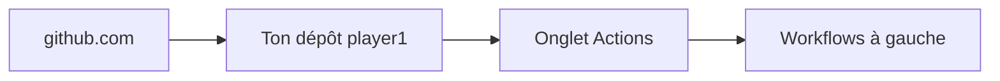

# GitHub — interface pas à pas

Tu te connectes avec ton compte GitHub ; ce guide indique **où cliquer** dans l’interface web [github.com](https://github.com).

**Important :** les workflows **Actions** (CI / Netlify) sont **optionnels**. Tu peux déployer uniquement avec **Render** + le fichier `render.yaml` à la racine du repo — voir **`DEPLOY_SIMPLE.md`** — sans configurer de secrets GitHub.

---

## 1. Mettre le projet sur GitHub (si ce n’est pas déjà fait)

1. Va sur **https://github.com/new**
2. **Repository name** : par ex. `player1` (ou le nom de ton dépôt local).
3. Laisse **Public** ou **Private** selon ton choix → **Create repository**.
4. En local, dans le dossier du projet :

```bash
cd /chemin/vers/player1
git remote add origin https://github.com/TON_USER/player1.git
git branch -M main
git add .
git commit -m "Air quality: workflows et déploiement"
git push -u origin main
```

*(Si `origin` existe déjà, adapte l’URL ou utilise `git remote set-url origin …`.)*

---

## 2. Où sont les **Actions** (CI / déploiement)



1. Ouvre **https://github.com/TON_USER/player1** (remplace `TON_USER`).
2. Barre horizontale sous le nom du dépôt : clique sur **Actions** (icône play dans un carré).
3. Colonne de **gauche** : liste des workflows, par exemple :
   - **Air quality — CI (build client)** — se lance tout seul sur push/PR dans `air-quality-web/`.
   - **Air quality — Deploy Netlify** — **uniquement à la main** (voir §4).

---

## 3. Ajouter les **secrets** (Netlify + URL API)

Chemin dans l’interface :

**Repo** → **Settings** (onglet tout à droite) → menu gauche **Secrets and variables** → **Actions** → **New repository secret**.

Tu ajoutes **trois** secrets (bouton vert **New repository secret** à chaque fois) :

| Name | Valeur (exemple) |
|------|-------------------|
| `NETLIFY_AUTH_TOKEN` | Token créé sur Netlify (User settings → Applications → Personal access tokens) |
| `NETLIFY_SITE_ID` | Netlify → ton site → **Site settings** → **Site details** → **Site ID** |
| `AIR_QUALITY_BACKEND_URL` | `https://ton-api.onrender.com` (sans `/` à la fin) |

Après chaque ajout : **Add secret**. La liste affiche les noms mais **pas** les valeurs.

---

## 4. Lancer le déploiement Netlify **à la main**

1. **Actions** (même onglet qu’au §2).
2. Dans la liste à **gauche**, clique **Air quality — Deploy Netlify**.
3. À droite, bandeau bleu / zone **Run workflow** :
   - Menu déroulant **Branch** : choisis **`main`** (ou ta branche).
   - Bouton vert **Run workflow**.

4. Un nouveau run apparaît en dessous ; clique dessus pour voir les logs (vert = OK).

---

## 5. Voir le résultat du **CI** (build sans déploiement)

À chaque **push** qui modifie `air-quality-web/**`, le workflow **Air quality — CI (build client)** part tout seul.

1. **Actions** → clique sur le run le plus récent.
2. Clique sur le job **build-client** pour ouvrir les étapes **Install** / **Build**.

---

## Récap des URLs utiles

| Objectif | Où |
|----------|-----|
| Liste des workflows | `https://github.com/TON_USER/player1/actions` |
| Secrets Actions | `https://github.com/TON_USER/player1/settings/secrets/actions` |
| Déploiement Render / Netlify (hors GitHub) | `air-quality-web/DEPLOY.md` |

---

## Si **Actions** est vide

- Vérifie que les fichiers existent bien sur GitHub : **Code** → dossier `.github/workflows/`.
- Premier push : parfois il faut **une minute** puis rafraîchir **Actions**.
- Dépôt fork : dans **Settings** → **Actions** → **General**, vérifie que les workflows sont autorisés.
